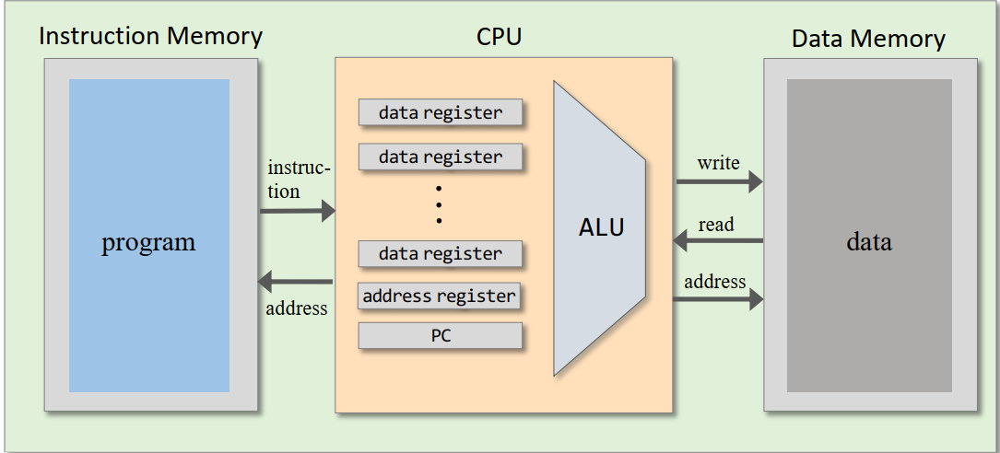
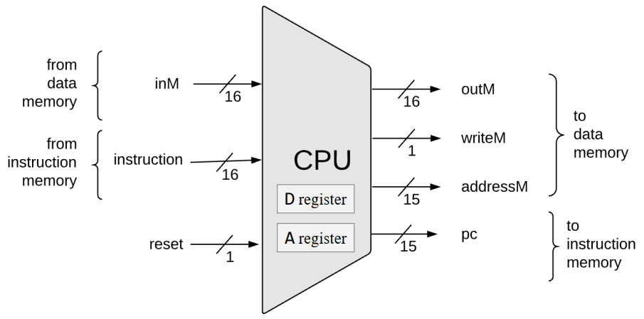
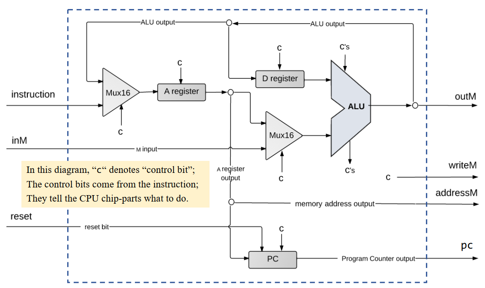

[官网](https://www.nand2tetris.org)
开始时间 2024/07/02, 完成时间 2024/08/12

# 基本数字电路
组合逻辑 (Combination Logic): 组合逻辑电路的输出仅依赖于当前输入信号, 而不依赖于电路之前的状态. 这类电路没有记忆功能, 输出是输入的直接组合. 常见的组合逻辑电路包括:
+ 加法器 (Adders)
+ 编码器 (Encoders)
+ 解码器 (Decoders)
+ 多路复用器 (Multiplexers, MUX)
+ 去多路复用器 (Demultiplexers, DEMUX)

时序逻辑 (Sequential Logic): 时序逻辑电路的输出不仅取决于当前输入信号, 还取决于电路之前的状态. 这类电路具有记忆功能, 通过时钟信号同步操作, 能够存储和处理状态信息. 常见的时序逻辑电路包括:
+ 触发器 (Flip-Flops)
+ 寄存器 (Registers)
+ 计数器 (Counters)
+ 有限状态机 (Finite State Machines, FSM)

Hardware Description Language (HDL): 硬件描述语言是一种用于描述数字电路的语言, 可以用于描述数字电路的结构和行为. 
+ Functional/declarative language
+ Commonly used HDLs: VHDL, Verilog
+ Need a hardware simulator to run HDL code
+ 需要关注一下, sub-bus 只能发生在 in 和 out 之间
+ https://www.nand2tetris.org/hdl-survival-guide

## Boolean algebra
基本运算: 
+ 与(AND): $x \cdot y$
+ 或(OR): $x + y$
+ 非(NOT): $\overline{x} \text{ or } \neg x$
+ 与非(NAND): $\neg (x \cdot y)$
+ 或非(NOR): $\neg (x + y)$

Boolean Formula 简化: 
+ Commutative Law (交换律)
+ Associative Law (结合律)
+ Distributive Law (分配律)
$$(x + y) \cdot z = x \cdot z + y \cdot z\\ 
(x \cdot y) + z = (x + z) \cdot (y + z)$$
+ De Morgan's Law (德摩根定律)
$$\overline{x + y} = \overline{x} \cdot \overline{y} \\
\overline{x \cdot y} = \overline{x} + \overline{y}$$
+ Idempotence Law (幂等律)
$$x + x = x \\
x \cdot x = x$$
+ Absorption Law (吸收律)
$$x + x \cdot y = x \\
x \cdot (x + y) = x$$
+ Involution Law (反演律)
$$ x + \overline{x} \cdot y = x + $$ 


Boolean function synthesis: 将逻辑功能转换为可实现的逻辑电路或布尔表达式的过程. 
+ 可以使用 Karnaugh Map (卡诺图) 简化布尔表达式
+ 任意的布尔函数都可以用一个由与、或、非门组成的电路来实现(或门其实可以也用与、非门实现). 也可以仅仅使用 NAND 门实现.
  - NOT(x) = x NAND x
  - AND(x, y) = NOT(x NAND y)


# Arithmetic Logic Unit (ALU)

### 大端模式与小端模式

- **大端模式 (Big-Endian)**: 低地址存放高位字节, 高地址存放低位字节. 
- **小端模式 (Little-Endian)**: 低地址存放低位字节, 高地址存放高位字节. 
  - 小端模式的好处是可以直接取出一个整数的低位字节, 同时拓展到高位字节时只需要简单补 0 即可. 

### 数字表示

- **无符号整数 (Unsigned Integer)**: 计算机内无符号整数使用原码表示. 
- **有符号整数**:
  - 正数的补码 (Two's Complement) 等于原码 (Sign-Magnitude) 等于反码 (One's Complement). 
  - 负数的补码等于绝对值的原码取反加一. 
  - 补码的好处：
    1. 解决反码表示中 +0 和 -0 不统一的问题. 
    2. 统一加法和减法操作. 
  - 补码可以理解为使用 $2^n - x$ 表示 $-x$. 

### 加法器

- **半加器 (Half Adder)**: 对两个单个位进行相加, 产生一个和位（Sum）和一个进位位（Carry）. 
  - Sum = A XOR B
  - Carry = A AND B

- **全加器 (Full Adder)**: 对两个单个位和一个进位位进行相加, 产生一个和位（Sum）和一个进位位（Carry）. 
  - Sum = A XOR B XOR Cin
  - Cout = (A AND B) OR (Cin AND (A XOR B))

- **加法器 (Adder)**: 由多个全加器组成, 用于对多位二进制数进行相加. 
  - **Ripple Carry Adder**: 串行进位加法器, 逐位计算, 速度慢. 
  - **Carry Lookahead Adder**: 并行进位加法器, 使用生成（Generate）和传播（Propagate）快速计算进位. 
    - Generate: Gi = Ai AND Bi
    - Propagate: Pi = Ai OR Bi
    - Carry: Ci+1 = Gi OR (Pi AND Ci), 这一式子可以递归展开. 

### 算术逻辑单元 (ALU)

- **功能**: 执行算术和逻辑运算. 
  - **算术运算**: 加法、减法、乘法、除法、增量、减量
  - **逻辑运算**: 与、或、非、异或
  - **位操作**: 移位、旋转
  - **比较操作**

- **组成部分**:
  - **操作数寄存器 (Operand Registers)**: 存储 ALU 的输入数据. 
  - **运算器**: 包括算术运算单元和逻辑运算单元. 
  - **状态寄存器 (Status Registers)**: 又称标志寄存器, 用于存储运算结果的状态信息, 如溢出 (Overflow Flag)、零 (Zero Flag)、符号 (Sign Flag) 等. 
  - **控制单元**: 接受来自控制器或指令解码器的指令, 确定需要执行的具体运算. 

# Memory

### 锁存器

锁存器是一种电平触发（level-triggered）的存储器件. 根据输入信号的状态, 锁存器可以存储一个比特的信息. 当输入信号有效时, 锁存器的输出跟随输入；当输入信号无效时, 锁存器保持其状态. 

SR 锁存器 (SR Latch): 两个输入端 S (Set) 和 R (Reset), 两个输出端 Q 和 ~Q. 
- S = 1, R = 0: Q = 1, ~Q = 0
- S = 0, R = 1: Q = 0, ~Q = 1
- S = 0, R = 0: 保持原状态
- S = 1, R = 1: 不确定状态 

SR 锁存器可以使用两个 NOR 门或两个 NAND 门实现. 

### Flip-Flop

触发器 (Flip-Flop) 是一种时序逻辑电路, 能够存储一个比特位的状态信息. 时钟数据触发器（Clocked Data Flip-Flop）根据时钟信号 (通常是上升沿或下降沿) 来改变触发器的状态.
最基本的触发器是 D 触发器 (D Flip-Flop), 有时也称为数据触发器 (Data Flip-Flop). D 触发器有一个数据输入端 (D) 和一个时钟输入端 (CLK), 以及一个输出端 (Q).

Flip-Flop 可以借助锁存器实现. 细节略. 

使用 D Flip-Flop 实现 1-bit 寄存器: 在 DFF 接受的信号的基础上还需要接受一个 Load 信号, 用于控制是否更新寄存器的值. 可以在 DFF 的输入端加一个 Mux, Mux 的控制信号是 Load 信号, 一个输入是 DFF 的输出, 另一个输入是 输入信号. 

RAM 就是一系列 w-bit 寄存器的集合, 每个寄存器有一个地址. 

### Program Counter (PC)
程序计数器 (Program Counter, PC) 是一种特殊的寄存器, 用于存储 CPU 下一条指令的地址. 在每个时钟周期, PC 的值会自动增加, 以便指向下一条指令. 此外, 为了支持跳转指令, PC 还可以接受来自控制器的输入, 以便跳转到指定的地址. reset 信号用于初始化 PC, 使其指向 ROM 的第一个指令.
PC 的逻辑如下:
``` 
if reset == 1 then PC = 0
else if load == 1 then PC = in
else PC = PC + 1
```
# Hack Computer Architecture and Machine Language

### Components
- **Data Memory (RAM)**
- **Instruction Memory (ROM)**: 储存程序指令
- **CPU**
- **Buses**

### Registers
- **A Register**: 跳转命令的目标地址, 此外有一个 side effect 是 M 寄存器的值 = RAM[A]. 
- **D Register**: Used for general-purpose storage.
- **M Register**: Refers to the value in RAM at the address specified by the A Register.

### Instruction Types
1. **A-Instruction**: `@value`
   - Sets the A Register to `value`.
   - `value` is a 15-bit non-negative integer or a symbol referring to a memory address.
   - Binary Format: `0 (value)_2`
      - `0`: Indicates an A-Instruction.
      - `(value)_2`: 15-bit binary value.
   
2. **C-Instruction**: `dest=comp;jump`
	- dest 和 jump 可以为空.
    - if (comp jump 0) 跳转执行储存在 ROM[A] 中的指令
    - Components:
       - `dest`: Specifies where to store the result (null, A, D, M, AD, AM, DM, ADM).
       - `comp`: Computation to be performed (various operations including arithmetic and logical).
       - `jump`: Conditional jump instructions (null, JGT, JEQ, JGE, JLT, JNE, JLE, JMP).

   - Binary Format: `111 a c1 c2 c3 c4 c5 c6 d1 d2 d3 j1 j2 j3`
        + 第一位的 1 表示这是一个 C-Instruction
        + 第二三位的 1 1 未被使用
        - `a c1-c6`: Specifies the computation (`comp`). `a=1` 用于指示使用了 M 寄存器. 
        - `d1-d3`: Specifies the destination (`dest`), 和 A, M, D 依次对应
        - `j1-j3`: Specifies the jump condition (`jump`).

### I/O Devices
- **Screen**
  - Resolution: 256x512 pixels
  - Memory: Starts at address 16384
  - Contains 8192 16-bit registers

- **Keyboard**
  - Memory: Address 24576
  - Contains a single 16-bit register
  - 0 indicates no key is pressed; other values are scan codes.

### Terminating a Program
- Using labels:
  ```asm
  (END)
  @END
  0;JMP
  ```

### Built-in Symbols
- **R0-R15**: Virtual registers (0-15). Used in A-Instruction and related to the M Register.
- **SCREEN**: Base address of the screen I/O device.
- **KBD**: Base address of the keyboard I/O device.
- **SP**: Stack Pointer (0)
- **LCL**: Local (1)
- **ARG**: Argument (2)
- **THIS**: Pointer to current object (3)
- **THAT**: Pointer to the object that is 4 words away (4)

### Branching & Labels
- **Labels**: Identifiers used to mark specific locations in code for jumps or branch instructions. Labels help in controlling the flow of execution.

### Variables
- **Declaration**: References to symbols not declared as labels are treated as variables.
- **Memory Allocation**: Variables are allocated starting from address 16 (0x0010), incrementing by 1 for each subsequent variable.

# Computer Architecture

在 **Von Neumann 架构** 下, 指令和数据共享同一存储器, 这会导致 **Fetch-execute clash**, 即取指令和执行指令之间的冲突, 进而导致 **Von Neumann Bottleneck**. 

而 **Harvard 架构** 下, 指令和数据分开存储, 通过两个独立的总线传输, 从而避免了 Von Neumann Bottleneck. Harvard 架构常用于嵌入式系统, 因为程序通常预先编写好并写入 ROM 中, 无需频繁修改；而通用计算机则更适合 Von Neumann 架构, 因为程序可以随时修改. 

**Hack Computer** 采用了 Harvard 架构. 地址总线可以同时访问两块内存：ROM 是一块 32K 的指令内存, RAM 包含了 16K 的数据内存、8K 的屏幕内存和键盘内存, 并考虑了 I/O 地址映射. 



### Hack CPU

CPU 的 Abstracion Layer 如下图所示, CPU 内部包括 ALU, 一个 A register, 一个 D register 以及一个 Program Counter (PC). 其中 reset 信号用于初始化 CPU, 使 PC 指向 ROM 的第一个指令.



### CPU Implementation
下图展示了 CPU 的具体实现: 


#### Key Signals and Operations
- **A Register**:
  - Set either explicitly by an A-instruction or when a C-instruction's `dest` field includes A.
- **ALU Operations**:
  - **Operands**: First operand from D Register, second operand from A or M Register (depending on the `a` field in C-instruction).
  - **Control Bits**: Derived directly from the `comp` field of the C-instruction.
- **PC Load Signal**:
  - Determined by the `jump` field of the C-instruction and ALU status registers.
  - Simplified Boolean expressions for this signal can be found in [BooleanSimplifier.py](BooleanSimplifier.py).
- **D Register Load Signal**:
  - Set to 1 when the instruction is a C-instruction with the `dest` field including D.
  - Ensure this condition to avoid incorrect updates during A-instructions.
- **WriteM Signal**:
  - Controls writing ALU output to the M Register.
  - Set to 1 for C-instructions with the `dest` field including M.

# Assembler

抛开 Symbols 的处理, 假设我们已经有了一个符号表, 那么汇编器的工作流程如下: 
1. 读取和预处理源文件
   - 遍历源文件, 逐行读取指令. 
   - 丢弃注释、空行和多余的空格. 
   - 返回处理后的指令字符串, 可以是实现成一个 Iterator. 

2. 指令解析和机器码生成
   - 根据指令字符串的格式解析出指令的类型和操作数. 
   - 根据指令的类型生成相应的机器码. 通常包括以下几类指令：
     - A-Instruction: 例如 `@value`, 生成相应的 16 位机器码. 
     - C-Instruction: 例如 `dest=comp;jump`, 解析 `dest`、`comp` 和 `jump` 字段并生成机器码. 
     - L-Instruction: 用于处理标签（labels）. 

在处理符号表时, Hack Assembly Language 有三种不同类型的符号：built-in symbols, labels 和 variables. 由于可能存在前向引用 (forward reference), 需要进行两次遍历：

1. 第一次遍历：处理标签
     - 遍历源文件, 将所有的标签（labels）加入符号表. 
     - 标签的作用是标记程序中的特定位置, 以便在后续的指令中进行跳转. 

2. 第二次遍历：处理符号和生成机器码
   - 遇到指令时, 根据符号表查找对应的地址：
     - 如果符号存在于符号表中, 使用其对应的地址. 
     - 如果符号不存在于符号表中, 则意味着遇到了一个新的变量, 从地址 16 开始给其分配一个地址. 
