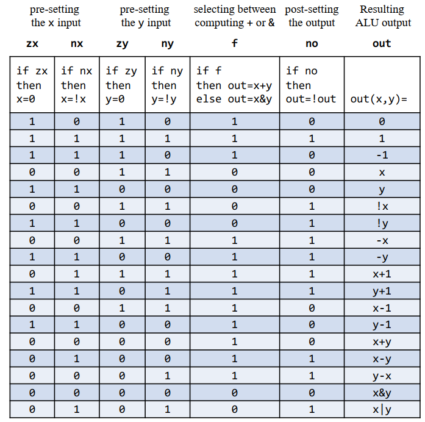
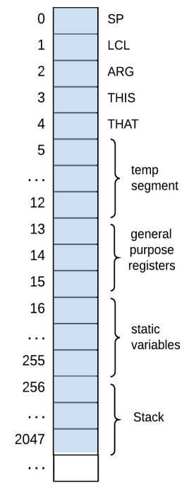
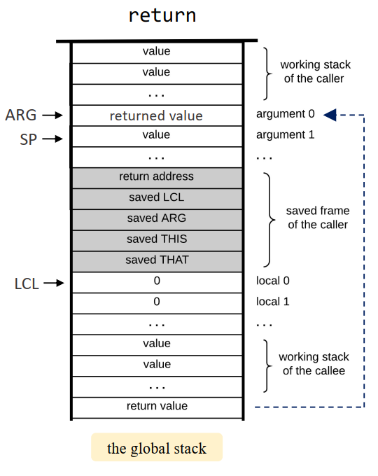
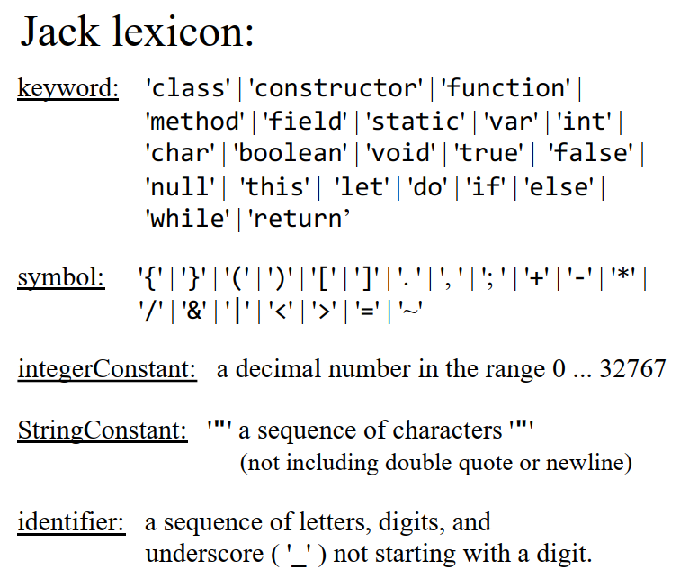
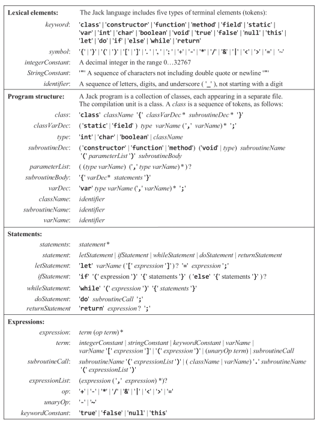

[官网](https://www.nand2tetris.org)
开始时间 2024/07/02, 完成时间 2024/09/20. 

# 基本数字电路
组合逻辑 (Combination Logic): 组合逻辑电路的输出仅依赖于当前输入信号, 而不依赖于电路之前的状态. 这类电路没有记忆功能, 输出是输入的直接组合. 常见的组合逻辑电路包括:
+ 加法器 (Adders)
+ 编码器 (Encoders)
+ 解码器 (Decoders)
+ 多路复用器 (Multiplexers, MUX)
+ 去多路复用器 (Demultiplexers, DEMUX)

时序逻辑 (Sequential Logic): 时序逻辑电路的输出不仅取决于当前输入信号, 还取决于电路之前的状态. 这类电路具有记忆功能, 通过时钟信号同步操作, 能够存储和处理状态信息. 常见的时序逻辑电路包括:
+ 触发器 (Flip-Flops)
+ 寄存器 (Registers)
+ 计数器 (Counters)
+ 有限状态机 (Finite State Machines, FSM)

Hardware Description Language (HDL): 硬件描述语言是一种用于描述数字电路的语言, 可以用于描述数字电路的结构和行为. 
+ Functional/declarative language
+ Commonly used HDLs: VHDL, Verilog
+ Need a hardware simulator to run HDL code
+ 需要关注一下, sub-bus 只能发生在 in 和 out 之间
+ https://www.nand2tetris.org/hdl-survival-guide

## Boolean algebra
基本运算: 
+ 与(AND): $x \cdot y$
+ 或(OR): $x + y$
+ 非(NOT): $\overline{x} \text{ or } \neg x$
+ 与非(NAND): $\neg (x \cdot y)$
+ 或非(NOR): $\neg (x + y)$

Boolean Formula 简化: 
+ Commutative Law (交换律)
+ Associative Law (结合律)
+ Distributive Law (分配律)
$$(x + y)\cdot z = x \cdot z + y \cdot z\\ 
(x \cdot y)+ z = (x + z)\cdot (y + z)$$
+ De Morgan's Law (德摩根定律)
$$\overline{x + y} = \overline{x} \cdot \overline{y} \\
\overline{x \cdot y} = \overline{x} + \overline{y}$$
+ Idempotence Law (幂等律)
$$x + x = x \\
x \cdot x = x$$
+ Absorption Law (吸收律)
$$x + x \cdot y = x \\
x \cdot (x + y)= x$$
+ Involution Law (反演律)
$$ x + \overline{x} \cdot y = x + $$ 


Boolean function synthesis: 将逻辑功能转换为可实现的逻辑电路或布尔表达式的过程. 
+ 可以使用 Karnaugh Map (卡诺图)简化布尔表达式
+ 任意的布尔函数都可以用一个由与, 或, 非门组成的电路来实现(或门其实可以也用与, 非门实现). 也可以仅仅使用 NAND 门实现.
  - NOT(x)= x NAND x
  - AND(x, y)= NOT(x NAND y)


# Arithmetic Logic Unit (ALU)

### 大端模式与小端模式

- **大端模式 (Big-Endian)**: 低地址存放高位字节, 高地址存放低位字节. 
- **小端模式 (Little-Endian)**: 低地址存放低位字节, 高地址存放高位字节. 
  - 小端模式的好处是可以直接取出一个整数的低位字节, 同时拓展到高位字节时只需要简单补 0 即可. 

### 数字表示

- **无符号整数 (Unsigned Integer)**: 计算机内无符号整数使用原码表示. 
- **有符号整数**:
  - 正数的补码 (Two's Complement)等于原码 (Sign-Magnitude)等于反码 (One's Complement). 
  - 负数的补码等于绝对值的原码取反加一. 
  - 补码的好处：
    1. 解决反码表示中 +0 和 -0 不统一的问题. 
    2. 统一加法和减法操作. 
  - 补码可以理解为使用 $2^n - x$ 表示 $-x$. 

### 加法器

- **半加器 (Half Adder)**: 对两个单个位进行相加, 产生一个和位 (Sum)和一个进位位 (Carry). 
  - Sum = A XOR B
  - Carry = A AND B

- **全加器 (Full Adder)**: 对两个单个位和一个进位位进行相加, 产生一个和位 (Sum)和一个进位位 (Carry). 
  - Sum = A XOR B XOR Cin
  - Cout = (A AND B)OR (Cin AND (A XOR B))

- **加法器 (Adder)**: 由多个全加器组成, 用于对多位二进制数进行相加. 
  - **Ripple Carry Adder**: 串行进位加法器, 逐位计算, 速度慢. 
  - **Carry Lookahead Adder**: 并行进位加法器, 使用生成 (Generate)和传播 (Propagate)快速计算进位. 
    - Generate: Gi = Ai AND Bi
    - Propagate: Pi = Ai OR Bi
    - Carry: Ci+1 = Gi OR (Pi AND Ci), 这一式子可以递归展开. 

### 算术逻辑单元 (ALU)

- **功能**: 执行算术和逻辑运算. 
  - **算术运算**: 加法, 减法, 乘法, 除法, 增量, 减量
  - **逻辑运算**: 与, 或, 非, 异或
  - **位操作**: 移位, 旋转
  - **比较操作** 

- **组成部分**:
  - **操作数寄存器 (Operand Registers)**: 存储 ALU 的输入数据. 
  - **运算器**: 包括算术运算单元和逻辑运算单元. 
  - **状态寄存器 (Status Registers)**: 又称标志寄存器, 用于存储运算结果的状态信息, 如溢出 (Overflow Flag), 零 (Zero Flag), 符号 (Sign Flag)等. 
  - **控制单元**: 接受来自控制器或指令解码器的指令, 确定需要执行的具体运算. 

Hack ALU 的行为如下图所示:

值得关注的是, 所有整数相关的算数运算都是基于补码在模 \(2^n\) 意义下的运算. 
- 例如, 对 \(-2^{n-1}\) 取负号, 得到的结果仍然是 \(-2^{n-1}\). -x 的操作实际上是通过 !(x + (111..11)_2) 实现的. 

# Memory

### 锁存器

锁存器是一种电平触发 (level-triggered)的存储器件. 根据输入信号的状态, 锁存器可以存储一个比特的信息. 当输入信号有效时, 锁存器的输出跟随输入；当输入信号无效时, 锁存器保持其状态. 

SR 锁存器 (SR Latch): 两个输入端 S (Set)和 R (Reset), 两个输出端 Q 和 ~Q. 
- S = 1, R = 0: Q = 1, ~Q = 0
- S = 0, R = 1: Q = 0, ~Q = 1
- S = 0, R = 0: 保持原状态
- S = 1, R = 1: 不确定状态 

SR 锁存器可以使用两个 NOR 门或两个 NAND 门实现. 

### Flip-Flop

触发器 (Flip-Flop)是一种时序逻辑电路, 能够存储一个比特位的状态信息. 时钟数据触发器 (Clocked Data Flip-Flop)根据时钟信号 (通常是上升沿或下降沿)来改变触发器的状态.
最基本的触发器是 D 触发器 (D Flip-Flop), 有时也称为数据触发器 (Data Flip-Flop). D 触发器有一个数据输入端 (D)和一个时钟输入端 (CLK), 以及一个输出端 (Q).

Flip-Flop 可以借助锁存器实现. 细节略. 

使用 D Flip-Flop 实现 1-bit 寄存器: 在 DFF 接受的信号的基础上还需要接受一个 Load 信号, 用于控制是否更新寄存器的值. 可以在 DFF 的输入端加一个 Mux, Mux 的控制信号是 Load 信号, 一个输入是 DFF 的输出, 另一个输入是 输入信号. 

RAM 就是一系列 w-bit 寄存器的集合, 每个寄存器有一个地址. 

### Program Counter (PC)
程序计数器 (Program Counter, PC)是一种特殊的寄存器, 用于存储 CPU 下一条指令的地址. 在每个时钟周期, PC 的值会自动增加, 以便指向下一条指令. 此外, 为了支持跳转指令, PC 还可以接受来自控制器的输入, 以便跳转到指定的地址. reset 信号用于初始化 PC, 使其指向 ROM 的第一个指令.
PC 的逻辑如下:
``` 
if reset == 1 then PC = 0
else if load == 1 then PC = in
else PC = PC + 1
```

# Hack Computer Architecture and Machine Language

### Components
- **Data Memory (RAM)**
- **Instruction Memory (ROM)**: 储存程序指令
- **CPU**
- **Buses**

### Registers
- **A Register**: 跳转命令的目标地址, 此外有一个 side effect 是 M 寄存器的值 = RAM[A]. 
- **D Register**: Used for general-purpose storage.
- **M Register**: Refers to the value in RAM at the address specified by the A Register.

### Instruction Types
1. **A-Instruction**: `@value`
   - Sets the A Register to `value`.
   - `value` is a 15-bit non-negative integer or a symbol referring to a memory address.
   - Binary Format: `0 (value)_2`
      - `0`: Indicates an A-Instruction.
      - `(value)_2`: 15-bit binary value.
   
2. **C-Instruction**: `dest=comp;jump`
    - dest 和 jump 可以为空.
    - if (comp jump 0)跳转执行储存在 ROM[A] 中的指令
    - Components:
       - `dest`: Specifies where to store the result (null, A, D, M, AD, AM, DM, ADM).
       - `comp`: Computation to be performed (various operations including arithmetic and logical).
       - `jump`: Conditional jump instructions (null, JGT, JEQ, JGE, JLT, JNE, JLE, JMP).

   - Binary Format: `111 a c1 c2 c3 c4 c5 c6 d1 d2 d3 j1 j2 j3`
        + 第一位的 1 表示这是一个 C-Instruction
        + 第二三位的 1 1 未被使用
        - `a c1-c6`: Specifies the computation (`comp`). `a=1` 用于指示使用了 M 寄存器. 
        - `d1-d3`: Specifies the destination (`dest`), 和 A, M, D 依次对应
        - `j1-j3`: Specifies the jump condition (`jump`).

### I/O Devices
- **Screen**
  - Resolution: 256x512 pixels
  - Memory: Starts at address 16384
  - Contains 8192 16-bit registers

- **Keyboard**
  - Memory: Address 24576
  - Contains a single 16-bit register
  - 0 indicates no key is pressed; other values are scan codes.

### Terminating a Program
- Using labels:
  ```asm
  (END)
  @END
  0;JMP
  ```

### Built-in Symbols
- **R0-R15**: Virtual registers (0-15). Used in A-Instruction and related to the M Register.
- **SCREEN**: Base address of the screen I/O device.
- **KBD**: Base address of the keyboard I/O device.
- **SP**: Stack Pointer (0)
- **LCL**: Local (1)
- **ARG**: Argument (2)
- **THIS**: Pointer to current object (3)
- **THAT**: Pointer to the object that is 4 words away (4)

### Branching & Labels
- **Labels**: Identifiers used to mark specific locations in code for jumps or branch instructions. Labels help in controlling the flow of execution.

### Variables
- **Declaration**: References to symbols not declared as labels are treated as variables.
- **Memory Allocation**: Variables are allocated starting from address 16 (0x0010), incrementing by 1 for each subsequent variable.

# Computer Architecture

在 **Von Neumann 架构** 下, 指令和数据共享同一存储器, 这会导致 **Fetch-execute clash**, 即取指令和执行指令之间的冲突, 进而导致 **Von Neumann Bottleneck**. 

而 **Harvard 架构** 下, 指令和数据分开存储, 通过两个独立的总线传输, 从而避免了 Von Neumann Bottleneck. Harvard 架构常用于嵌入式系统, 因为程序通常预先编写好并写入 ROM 中, 无需频繁修改；而通用计算机则更适合 Von Neumann 架构, 因为程序可以随时修改. 

**Hack Computer** 采用了 Harvard 架构. 地址总线可以同时访问两块内存：ROM 是一块 32K 的指令内存, RAM 包含了 16K 的数据内存, 8K 的屏幕内存和键盘内存, 并考虑了 I/O 地址映射. 


### Hack CPU

CPU 的 Abstracion Layer 如下图所示, CPU 内部包括 ALU, 一个 A register, 一个 D register 以及一个 Program Counter (PC). 其中 reset 信号用于初始化 CPU, 使 PC 指向 ROM 的第一个指令.


### CPU Implementation
下图展示了 CPU 的具体实现: 


#### Key Signals and Operations
- **A Register**:
  - Set either explicitly by an A-instruction or when a C-instruction's `dest` field includes A.
- **ALU Operations**:
  - **Operands**: First operand from D Register, second operand from A or M Register (depending on the `a` field in C-instruction).
  - **Control Bits**: Derived directly from the `comp` field of the C-instruction.
- **PC Load Signal**:
  - Determined by the `jump` field of the C-instruction and ALU status registers.
  - Simplified Boolean expressions for this signal can be found in [BooleanSimplifier.py](BooleanSimplifier.py).
- **D Register Load Signal**:
  - Set to 1 when the instruction is a C-instruction with the `dest` field including D.
  - Ensure this condition to avoid incorrect updates during A-instructions.
- **WriteM Signal**:
  - Controls writing ALU output to the M Register.
  - Set to 1 for C-instructions with the `dest` field including M.

# Assembler

抛开 Symbols 的处理, 假设我们已经有了一个符号表, 那么汇编器的工作流程如下: 
1. 读取和预处理源文件
   - 遍历源文件, 逐行读取指令. 
   - 丢弃注释, 空行和多余的空格. 
   - 返回处理后的指令字符串, 可以是实现成一个 Iterator. 

2. 指令解析和机器码生成
   - 根据指令字符串的格式解析出指令的类型和操作数. 
   - 根据指令的类型生成相应的机器码. 通常包括以下几类指令：
     - A-Instruction: 例如 `@value`, 生成相应的 16 位机器码. 
     - C-Instruction: 例如 `dest=comp;jump`, 解析 `dest`, `comp` 和 `jump` 字段并生成机器码. 
     - L-Instruction: 用于处理标签 (labels). 

在处理符号表时, Hack Assembly Language 有三种不同类型的符号：built-in symbols, labels 和 variables. 由于可能存在前向引用 (forward reference), 需要进行两次遍历：

1. 第一次遍历：处理标签
     - 遍历源文件, 将所有的标签 (labels)加入符号表. 
     - 标签的作用是标记程序中的特定位置, 以便在后续的指令中进行跳转. 

2. 第二次遍历：处理符号和生成机器码
   - 遇到指令时, 根据符号表查找对应的地址：
     - 如果符号存在于符号表中, 使用其对应的地址. 
     - 如果符号不存在于符号表中, 则意味着遇到了一个新的变量, 从地址 16 开始给其分配一个地址. 

# Virtual Machine 

虚拟机 (Virtual Machine, VM)是一种软件模拟的计算机系统, 可以在物理计算机上运行. 虚拟机的指令集称为虚拟机语言 (Virtual Machine Language), 通常是一种高级语言. 虚拟机主要可以分为两种类型, 系统虚拟机和进程虚拟机, 前者模拟整个物理计算机, 包括硬件和操作系统, 常见的有 VMware, VirtualBox 等；后者则模拟一个独立的进程环境, 用于抽象程序的运行环境, 使程序可以跨平台运行, 常见的有 Java 虚拟机 (JVM)和 .NET CLR (Common Language Runtime).

对于 JVM 而言, 在编译阶段, Java 源代码首先被编译器 (javac)编译成字节码 (bytecode, .class 文件), 字节码是一种中间语言, 与具体的硬件无关. 在执行阶段, JVM 读取字节码, 并通过解释器或即时编译器 (JIT)将其翻译为机器码在实际的硬件上执行.

根据虚拟机架构的不同, 虚拟机可以分为栈式虚拟机 (Stack-based VM)和寄存器虚拟机 (Register-based VM). 在栈式虚拟机中, 指令通常不需要明确指定操作数的位置, 而是隐式地从栈中获取操作数并将结果压回栈中. 寄存器虚拟机则更接近于物理计算机的架构, 指令需要明确指定操作数的位置, 并将结果存储在寄存器中. JVM 是一种栈式虚拟机. 

虚拟机的内存被划分为多个内存段 (Memory Segments), 以 JVM 为例, 包括:
- Heap: 存放对象实例和数组
- Stack: 存放局部变量, 方法调用信息 (如参数, 返回值, 局部变量)和部分数据的中间结果. 每个线程都有自己的栈, 每个栈帧对应一次方法调用.
- Method Area: 存放类的元数据 (类信息, 方法数据, 常量池, 静态变量等)
- Program Counter Register: 存放当前线程执行的字节码指令的地址
- Native Method Stack: 存放本地方法调用的信息. Native 方法是使用其他编程语言编写的代码, 可以通过 JNI 调用.
- Runtime Constant Pool: 存放编译时生成的字面量和符号引用. 这些常量在类或接口被加载时会被放入到方法区的运行时常量池中.

### Jack Virtual Machine

Jack Virtual Machine Language 包含以下指令：
- `push` 和 `pop` 用于操作栈
- 算数逻辑指令: `add`, `sub`, `neg`, `eq`, `gt`, `lt`, `and`, `or`, `not`
- Branching: `label`, `goto`, `if-goto`
- Function Calls: `function`, `call`, `return`

**虚拟机地址空间**: 
- 虚拟机栈:
  - 栈从内存地址 256 开始, 2047 结束. 栈指针 `SP` 指向下一个空闲的栈顶元素, 存放在地址 0.
- 内存段 (Memory Segments):[地址空间, VM Language 通过栈 ...]
  虚拟机的地址空间被划分为多个内存段, 每个段的访问指令为 `push/pop segment i`.八个内存段分别为：
  1. **local**:
     - 存放当前函数的局部变量, 段基址为 `LCL`. 
  2. **argument**:
     - 存放当前函数调用的参数, 段基址为 `ARG`.
  3. **this**:
     - 存放 the *fields* of the current object, 段基址为 `THIS`.
  4. **that**:
     - 存放 the *elements* of the current array, 段基址为 `THAT`. 用于操作数组元素.
  5. **static**:
     - 存放类的静态变量 (static variable), 起始地址为 16, 结束地址为 255. [和当前的类名有关]
  6. **pointer**:
     - 用于设置 `this` 和 `that` 寄存器, `0` 和 `1` 分别对应 `THIS` 和 `THAT`.
  7. **constant**:
     - 仅为语法需要而设定, 并不会在内存中存储常量.
  8. **temp**:
     - 一个固定的大小为 8 的内存段, 起始地址为 5. 临时寄存器. 
此外, `R13-R15` 为通用寄存器; 2048 开始的内存地址为堆内存.




### Jack VM Translator

VM Translator 的目的是将 Jack VM 代码翻译成对应的机器代码, 在这里是 Hack Assembly Language. 算数指令和逻辑指令的翻译比较直接, 而 Branching 和 Function Calls 需要更多的处理. 其余需要注意的是栈指针的更新. 

**Branching**: Jack VM 分支的实现和汇编语言类似, 通过 `label`, `goto` 和 `if-goto` 指令实现.
- `label labelName`: 创建一个标签用于后续跳转.
  `(labelName)`
- `goto labelName`: 无条件跳转到指定的标签, 即 
  ```
  @labelName
  0;JMP
  ```
- `if-goto labelName`: 当栈顶元素非零时跳转到指定的标签.
  ```
  @SP
  AM=M-1
  D=M
  @labelName
  D;JNE
  ```

**Function Calls**:
和 Java 类似, 一个 Jack 应用程序由多个位于同一文件夹下的 .jack 类文件组成, 每个文件对应一个类. 编译器将每个 .jack 类文件编译成一个 .vm 文件, 该文件包含了该类的所有方法, 每个方法的命名为 `fileName.methodName`.

- `function funcName nVars`: 用于声明一个函数, `nVars` 为函数的拥有的局部变量个数.
  - 申明一个函数时, 首先需要创建一个标签 `(funcName)` 作为函数的入口地址, 然后将 `nVars` 个 0 压入栈中, 作为局部变量的初始值(不初始化局部变量也可以, 取决于约定, 只需要简单地增加 SP 的值即可).
- `call funcName nArgs`: 用于调用一个函数, `nArgs` 为函数的参数个数. 函数调用的正确实现依赖于具体的 **Calling Convention**. 
  - Caller 在调用之前首先需要将 Callee 需要的参数压入栈. 
  - 创建一个标签, 用于标记调用完成后的返回地址.
  - 依次将返回地址, LCL, ARG, THIS, THAT 压入栈中, 并更新 ARG 和 LCL 的值, 完成上下文切换.
  - 跳转到 Callee 函数的入口地址.
- `return`: 用于返回函数调用. 
  - Callee 在返回之前首先需要将返回值压入栈. **在 Jack 中, 函数总是会返回一个值, 即使返回值为 `void`, 也会将 `0` 压入栈中, 这时对于 Caller 来说, 需要将返回值弹出栈 `(pop temp 0)`.** 
  - 将栈顶的元素存放在 ARG 0 处. 
  - 恢复寄存器的值, 并跳转到返回地址.
  - 值得注意的是, 由于函数并不总是有参数, 在函数没有参数的时候, return address 会被存放在 ARG 0 处, 因此在使用返回值覆盖 ARG 0 之前需要将原来的值存放在临时寄存器中, 以便函数能够正确返回. 

函数调用整体实现的目的是使得 Callee 的执行对于 Caller 来说是**透明的**. Callee 返回后, 函数栈中添加了返回值, SP++, 但是其余的寄存器和函数调用之前一样.


# Jack Programming Language

本节的目的一是学习 Jack 语言的基本语法以便后续实现编译器, 二是了解一种高级语言的设计的基本思想. 

Jack 是一个 JAVA-like 的 OOP 语言, weakly typed (编译器不提供类型检查), 不支持继承. 

类(Class) 是一个基本的编译单元, 一个文件对应一个类, 类名和文件名一致且首字母大写. 大致上有两种类:
+ 第一种类提供了 functionality 或者说一组 services, 类似 MATH 类, 提供了一组数学运算的方法.
+ 第二种类和面向对象 (Objects) 编程思想密切相关, 用于封装对象的属性和方法, 通常包括以下几个部分：成员变量 (Fields), 类的静态变量 (Statics)以及与它们对应的 getter, setter, 构造函数 (Constructor), 析构函数 (Deconstructor)和一组方法 (Subroutines).

用户程序的入口是一个名为 `Main` 的类, 该类必须包含一个 `main` 方法, 作为程序的入口点, 即 `Main.main` 方法.

### Bascic Syntax
**Comments**: 
  - `//`: Inline comments
  - `/* */`: Block comments
  - `/** */`: API Documentation comments

**Primitive Data Types**: `int`(16 bits non-negative integer), `char`(unicode character), `boolean`(true or false).

**Variable**:  
- 变量申明: `var/static/field varType varName1, varName2, ...;`
  - `var`: 函数内部的局部变量
  - `static`: 类的静态变量
  - `field`: 类的成员变量 
- 变量类型: `int`, `char`, `boolean`, `className`
- 变量/数组赋值: `let varName = expression;`

**Method/Function**: 
- 方法申明:   
  ``` java
  constructor className constructorName(paramType paramName1, paramType paramName2, ...){
      // Subroutine body
      return this; // Return statement
  }

  method/function returnType methodName(paramType paramName1, paramType paramName2, ...){
      // Subroutine body
      return expression; // Return statement
  }
  ```
  - **Constructor**: 用于初始化对象, 返回 `this`. 在 Java 中不需要返回 `this`, 编译器会隐式地完成这部分工作. 默认的名字是 `new`, 但是可以自定义.
  - **Method**: 用于操作具体的对象, 可以访问对象的成员变量. 这类函数总是有一个隐含的 `this` 参数, 用于指向调用该方法的对象.
  + **Function**: 实例无关方法, 用于执行某些独立于类实例的任务.
  + **Return Statement**: 用于返回值, 支持表达式.  `return` 语句是强制的, 即使返回值为 `void`, 这是为了简化编译器的设计.  
  + 析构函数设计成一个 method, 默认名字为 `dispose`. 

- 方法调用: `do methodName(param1, param2, ...)`
- Jack 中的方法总是有返回值, 即使返回值为 `void`, 也需要使用 `return` 语句. 这是为了简化编译器的设计.

**control flow:** `if`, `else`, `while`. 
**No operator priority**: 没有运算符优先级, 需要使用括号明确指定运算顺序.

# Complier 

## Compiler Overview
编译器的工作通常分为几个主要阶段, 每个阶段完成特定的任务, 从而将高级编程语言的源代码转换为目标机器可以执行的二进制代码. 这些阶段可以大致分为前端, 中端和后端. 

### 1. **前端 (Front End)**
   前端负责分析源代码并将其转换为中间表示 (Intermediate Representation, IR). 前端的任务包括词法分析, 语法分析, 语义分析, 以及中间代码生成. 
   - **词法分析 (Lexical Analysis)**:
     - 作用：将源代码转换成一系列的词法单元 (tokens). 
     - 结果：输出 tokens 序列. 

> Lex 是一个词法分析器生成器, 可以将输入的字符流分割成更小的、具有语义意义的单元, 称为词法单元或记号 (tokens). 其现代版本是 Flex.
> - **输入**：Lex 文件，定义了一组模式和与之关联的动作。每个模式是一个正则表达式，用于匹配输入流中的特定字符序列；动作是与模式匹配时要执行的代码。
> - **输出**：C 代码，包含一个 `yylex` 函数，该函数负责扫描输入并识别词法单元。

   - **语法分析 (Syntax Analysis)**:
     - 作用：将词法分析生成的 tokens 组织成符合语法规则的结构, 通常生成抽象语法树 (AST). 
     - 结果：输出抽象语法树 (AST). 

> Yacc (Yet Another Compiler Compiler) 是一个用于生成语法分析器的工具. 语法分析器接收词法分析器生成的词法单元序列, 按照语法规则对其进行分析, 并生成相应的结构化表示 (通常是抽象语法树). 其现代版本是 Bison.
> - **输入**：Yacc 文件，定义了一组语法规则（类似于巴科斯范式），每个规则关联了相应的动作，这些动作通常用于构建语法树或执行其他与语法分析相关的操作。
> - **输出**：C 代码，包含一个 `yyparse` 函数，该函数负责从词法分析器接收词法单元，并根据语法规则对其进行分析。

   - **语义分析 (Semantic Analysis)**:
     - 作用：检查语法树是否符合语言的语义规则, 如类型检查, 作用域检查, 函数调用的参数匹配等. 
     - 结果：输出经过语义检查的 AST, 通常还会进行一些语义注释. 
   - **中间代码生成 (Intermediate Code Generation)**:
     - 作用：将经过语义分析的抽象语法树转换为一种中间表示 (IR), 这通常是与机器无关的代码形式, 如三地址码或静态单赋值形式 (SSA). 
     - 结果：输出中间代码 (IR). 
### 2. **中端 (Middle End)**
   中端主要负责优化中间表示, 目的是生成效率更高的代码. 
   - **中间代码优化 (Intermediate Code Optimization)**:
     - 作用：对中间表示进行优化, 包括死代码消除, 循环优化, 常量传播, 代码移动等, 以提高执行效率或减少代码大小. 
     - 结果：输出优化后的中间代码 (IR). 
### 3. **后端 (Back End)**
   后端负责将优化后的中间表示转换为目标机器代码, 并进行最终的优化. 
   - **目标代码生成 (Target Code Generation)**:
     - 作用：将中间代码转换为目标机器的指令集代码, 如 x86, ARM 等机器代码. 
     - 结果：输出汇编代码或机器代码. 
   - **目标代码优化 (Target Code Optimization)**:
     - 作用：在生成目标代码后, 进一步优化代码以提高执行效率, 通常包括指令选择, 寄存器分配, 流水线优化等. 
     - 结果：输出优化后的机器代码. 
   - **汇编与链接 (Assembly and Linking)**:
     - 作用：将生成的汇编代码转换为机器代码, 并将多个目标文件链接成一个可执行文件或库. 
     - 结果：最终生成可执行文件或库文件. 

### 上下文无关文法 (Context-Free Grammar, CFG)

**上下文无关文法 (Context-Free Grammar, CFG)** 是一种用于定义编程语言、自然语言和其他形式语言语法的数学模型。它由规则组成，每个规则可以递归地定义语言中的语法结构。上下文无关文法广泛应用于编译器设计中的**语法分析**阶段，用来解析和分析程序的结构。

上下文无关文法通常由四部分组成：
1. **非终结符（Nonterminal symbols）**：表示语法中的抽象符号，通常用来定义更复杂的结构。例如，`Expression` 表示一个表达式，`Statement` 表示一个语句。可以通过一组生产规则（production rules）递归地展开成其他非终结符或终结符表示文法中的规则，用来描述语言的语法结构. 

2. **终结符（Terminal symbols）**：表示实际出现在输入中的基本符号（词法单元或字符），例如关键字、操作符、标识符等。在语法规则中，终结符无法再展开。
3. **起始符号（Start symbol）**：文法中的一个特殊的非终结符，表示语法分析的开始，通常表示整个程序或表达式的顶层结构。
4. **产生式规则（Production rules）**：定义非终结符如何展开为其他非终结符或终结符的规则。形式是：`非终结符 → 一些非终结符和终结符的组合`。

**LL文法**是一种特殊的上下文无关文法，用于语法分析器（编译器的一个组成部分）来**自上而下**解析输入符号。LL文法主要用于构建**递归下降解析器**或其他类型的自上而下解析器。LL文法的名字来自以下几个特点：

- **L**：从**左到右**扫描输入（Left to right）。
- **L**：生成**最左推导**（Leftmost derivation），即每次展开文法规则时，始终优先展开最左边的非终结符。
- **k**：`LL(k)`文法中的`k`表示解析时需要查看的**前瞻符号**的数量。

> Language Server Protocol (LSP) 是由 Microsoft 为 Visual Studio Code 开发并开源的一种协议，用于在编辑器（如 VS Code、Atom、Eclipse 等）和编程语言的语言服务器之间进行通信。LSP 使得编辑器和 IDE 能够通过统一的方式为各种编程语言提供高级功能，如代码补全、语法检查、定义跳转、重构等. 

## Jack Compiler

Jack 是一个 Java-like 的语言, two-tier compilation. 将 VM Code 作为中间表示, VM Translator 用于将中间表示转换为对应硬件平台的机器码. Jack Compiler 主要关注于将 Jack 语言编译为 VM Code.

Jack Complier 的实现整体上有 Lexical Analysis, Syntax Analysis, 以及 Code Generation 三个部分.  
+ No error handling. 
+ top-down parsing.

### 词法分析 (Lexical Analysis)

下图显示了 Jack 语言的词法单元 (tokens) 有哪些类型. 


**XML (eXtensible Markup Language)**, 用于存储和传输数据的通用标记语言. 在本例中, XML 用于存储 Jack 语言的语法规则. XML 由一系列的元素 (elements) 组成, 每个元素包含一个开始标签 (start tag) 和一个结束标签 (end tag), 之间包含元素的内容. 为了不和 HTML 标签冲突, 分别使用 `&lt`, `&gt`, `&amp` 来表示 `<`, `>`, `&`.

> Markup Language: 标记语言, markup 指的是文本中用来定义结构或格式的符号或代码. 常见的标记语言有 HTML, XML, Markdown 等.


### 语法分析

Jack 的语法可以由下图中的规则定义


#### Variables & Symbol Table

首先, 虚拟机是基于内存段进行变量操作的, 不同类型的变量需要转为段内的偏移量进行操作. 根据变量出现的位置和申明的关键字可以将变量分为四类: 
- `static` 变量: 对应 `static` 内存段, 出现在 subroutine 定义之前. 
- `field` 变量: 对应 `this` 内存段, 出现在 subroutine 定义之前.
- `argument` 变量: 对应 `argument` 内存段, 出现在 subroutine 申明中.
- `var` 变量: 对应 `local` 内存段, 出现在 subroutine 实现中.

在编译 `classVarDec`, `parameterList`, `varDec` 三条规则时, 需要将变量的类型和名称加入符号表.

根据变量定义的位置, 变量有着不同的作用域 (scope), 不同作用域中可以有相同的变量名. Jack 语言中的作用域可以分为 Class Scope 和 Subroutine Scope, 搜索一个变量时, 需要先在 Subroutine Scope 中搜索, 如果找不到再在 Class Scope 中搜索. 在一些高级语言中, 变量的作用域往往可以进一步细化, 这种 Nested Scope 可以使用链表来实现.

此外, 由于机器语言是基于过程 (procedureal) 的, 为了编译 OOP 语言中 `method` 类型的方法, 总是将类本身的基址作为一个隐含的参数传递给方法.

#### Expressions

运算符的结合性 (associativity) 指的是在表达式中如果有多个相同优先级的运算符时, 它们的计算顺序是从左到右还是从右到左. 例如, 加法和减法是左结合的, 而赋值运算符是右结合的. 

Jack 中没有运算符的优先级, 所有运算符都是左结合的. 如果想要实现运算符的优先级, 可以通过运算符优先级解析法 (Precedence Climbing) 等算法实现. 

Expression 的 Production Rules 为:
- `term`: `integerConstant | stringConstant | keywordConstant | varName | varName '[' expression ']' | subroutineCall | '(' expression ')' | unaryOp term`
- `expression`: `term (op term)*`

对于 `stringConst`, 由于 Jack 没有字符串常量池, 如果不能确定字符串常量出现的位置, 就不能确定何时释放内存. 例如如果字符串常量出现 `Output.printString("Hello, World!")` 中, 那么在 `printString` 方法结束后, 该字符串常量需要被释放, 而 `let str = "Hello, World!"` 中, 字符串需要由用户释放. 现在版本的 `stringConst` 实现有内存泄漏的问题.

在编译 `term` 的时候, 如果当前的 token 是一个 identifier, 例如 `foo`, 这又可能是一个单纯的变量名, 也有可能是数组访问或者函数调用, 这时需要应用 LL(2) 文法, 有以下几种情况: 
- `foo`: 变量名, 直接编译为 `push segment index`
- `foo[expression]`: 数组访问.
- `foo(expressionList)`: 函数调用, 需要区分是 method 还是 function, 以便正确地设置 `this` 指针.
- `Foo.bar(expressionList)`: 这时 `Foo` 是一个类名, `bar` 是一个实例无关方法, 不需要设置 `this` 指针.
- `foo.bar(expressionList)`: 这时 `foo` 是一个对象, `bar` 是一个实例相关方法, 需要设置 `this` 指针.

#### Statements

Statement 的实现根据对应的关键词进行分发即可, 注意以下两点:
- `do subroutineCall;`: 由于 `do` 语句不需要返回值, 在编译时需要将返回值弹出栈, 此外, subroutineCall 由于是一个表达式, 可以直接调用 `compileExpression` 方法.
- `return expression? ;`: 在编译 `return` 语句时, 需要判断是否有返回值, 如果有返回值, 需要先编译表达式, 否则需要将 `0` 压入栈中.
- `let` 有可能是一个数组访问, 也有可能是一个变量赋值, 需要根据后续的 token 进行判断.

#### 数组访问

数组的访问通过 `that` 内存段实现, 数组的访问需要注意两点: 数组的访问可能存在嵌套; 赋值语句的两端都有可能存在数组访问.

# Jack OS

Jack OS 局限于一组 standard libraries 和 services, 分别是 `Array`, `String`, `Math`, `Memory`, `Output`, `Screen`, `Keyboard`, `Sys`. OS 被组织成了一组编译好的 .vm 文件. 

Math: 
- 数学运算的局限点在硬在于硬件没有乘法, 除法, 移位等指令. 此外, Jack 必须被编译为 VM Language, 不能使用汇编语言编写. 
- 类似 Java, Jack 中的整数都是 16 bit 有符号整数, 数学函数实现时需要注意溢出问题.
- `multiply`: 乘法运算, 通过多次累加实现, 由于补码的表示, 计算结果在模 \(2^{n}\) 意义下总是正确的. 
- `divide`: 整数商, 使用**倍增法**实现除法运算, 计算之前提取符号. 
- `sqrt`: 计算平方根, 二分查找. 二分的过程中有可能溢出. 
- `max`, `min`: 需要注意操作数的范围, 例如 `max(2^15, 0) = 0`.
- `abs`: 对于 `INT_MIN`, 由于其绝对值超出了 16 位整数的范围, 需要特殊处理. 在某些编译器中, `abs(INT_MIN)` 的结果是 `INT_MIN`. 

Merory:
- 如何访问和修改任意内存地址. 申请一个静态数组 `static Array ram;` 用于模拟内存, 初始化时另 `let ram = 0`
- 如何分配和释放内存: 某种形式的空闲列表
  - 省略了空闲列表的合并. 


